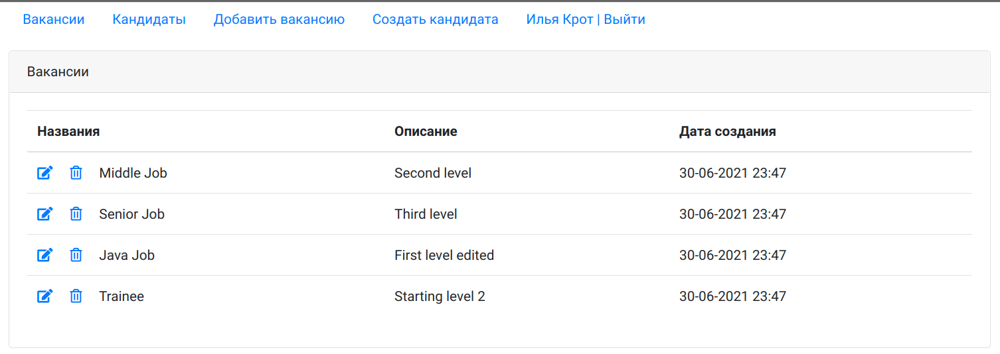
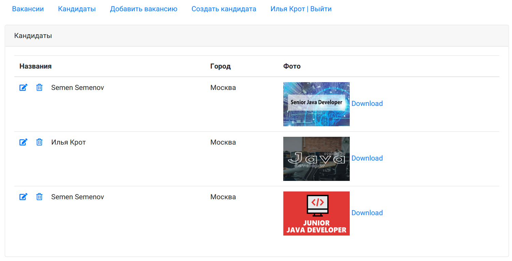
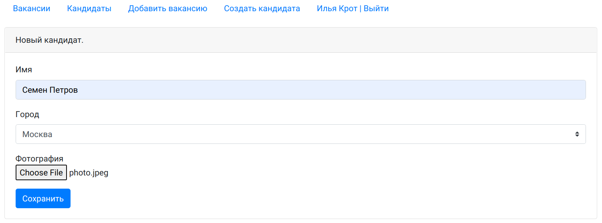
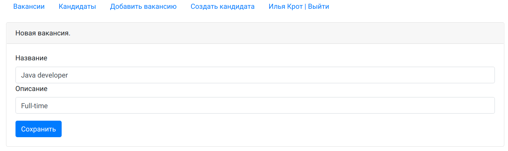
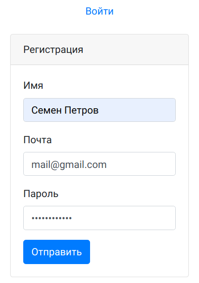
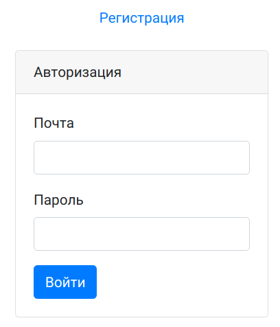
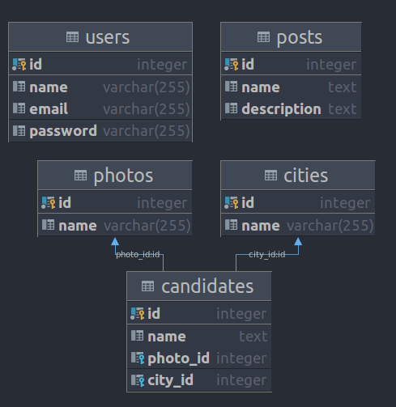

# Проект - Dream job

## Описание
Данное приложение с web-интерфейсом представляет собой биржу работы.
В системе будут два типа пользователей: кандидаты и менеджеры. Кандидаты будут публиковать резюме. Менеджеры будут публиковать вакансии о работе.
Реализована возможность добавления фото для кандидата, которое после добавления можно также скачать.
Только авторизованные пользователи могут просматривать списки вакансий и кандидатов, а также добавлять новые вакансии и кандидатов.

## Технологии
* Java 14
* Java Servlets
* PostgreSQL
* JDBC
* Apache TomCat
* Libraries:  
  * Apache Commons FileUpload
  * Apache Commons DBCP
  * GSON
* JSP/JSTL
* Javascript, AJAX, HTML, Bootstrap
* Junit, Mockito
* Maven

## Функциональность

#### Страница вакансий

#### Страница кандидатов

#### Страница добавления кандидата

#### Страница добавления вакансии

#### Регистрация

#### Авторизация

#### Схема базы данных

#### Контакты

&nbsp;
&nbsp;